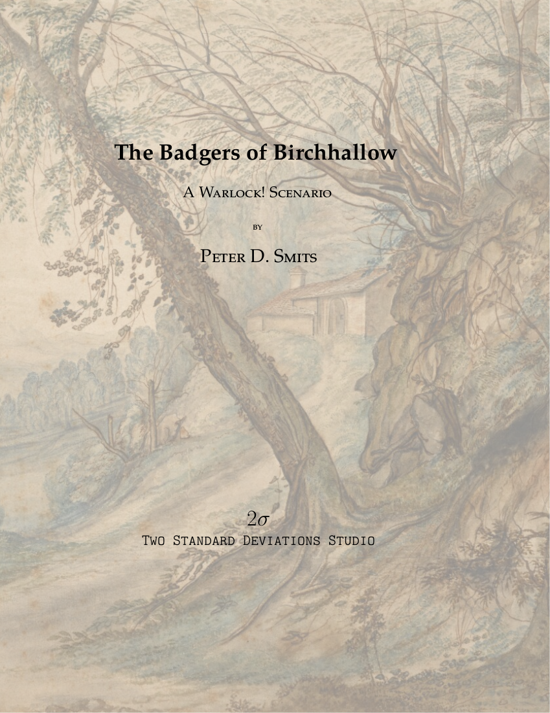
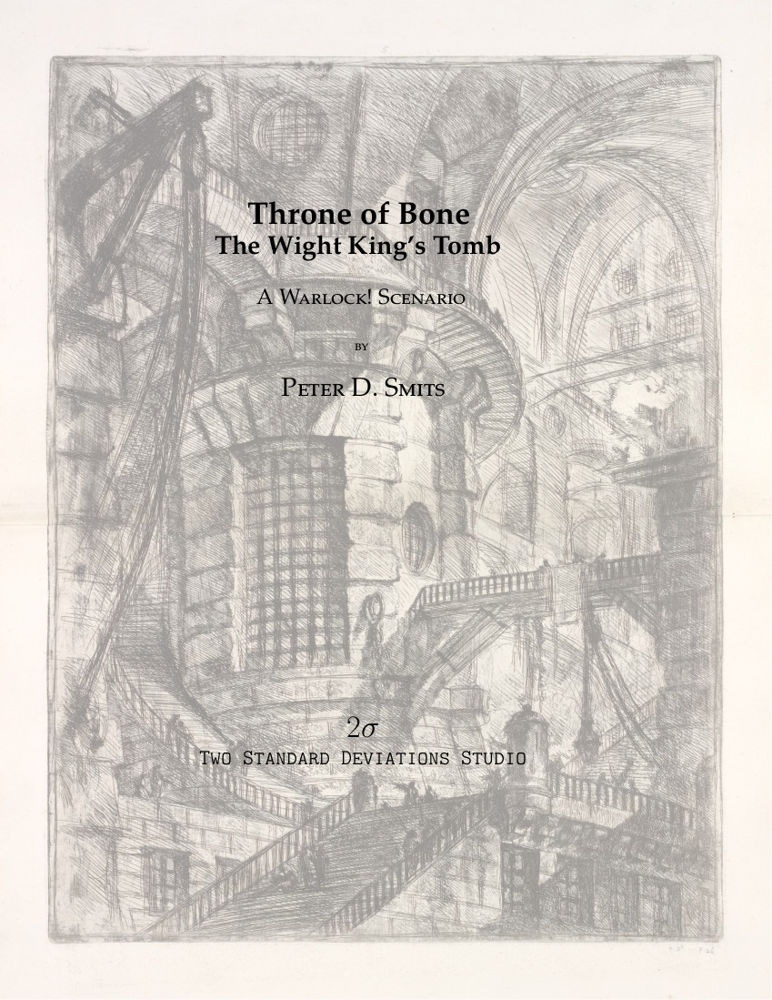

## Scenarios for Warlock!

### The Badgers of Birchhallow

:::: {.grid}

::: {.g-col-4}

:::

::: {.g-col-6}
This investigative scenario presents a town in peril where the PCs have an opportunity to save the town from a mysterious threat. The mystery escalates from a small town investigation to a short wilderness traversal and finally to exploring a strange underground cave complex.

Birchhallow is a quaint halfling village famous for the quality of its tobacco and for hosting the annual Badger Festival. This year's Badger Festival is coming up, and the town is all aflutter in anticipation. However, the run-up to this year's festival is not going smoothly -- many of the prized giant badgers have fallen ill, the tobacco plants are suffering from a mysterious fungus, and the largest batch of cider for the festival was found to be tainted and unsuitable for consumption.

This scenario is designed for PCs in their first career but can easily be adapted for more advanced PCs. 
This scenario is compatible with ["Warlock! Traitor's Edition" by Greg Saunders](https://www.drivethrurpg.com/product/383512/Warlock-Traitors-Edition). 
This product is an independent production by Peter D. Smits/Two Standard Deviations Studio and is not affiliated with Fire Ruby Designs. 
:::

::: {.g-col-2}

:::

::::

______________________________________________

### Throne of Bone: The Wight King's Tomb

:::: {.grid}

::: {.g-col-4}

:::

::: {.g-col-6}
There once was a great and terrible Wight King name Balthier Kane who wielded a bloodthirsty magic axe. In life he led the people of Petrini down from the heathlands to wage war on the goblins and humans of the plains and the forest.

Recently, the magic sealing Balthier’s tomb has failed. The Wight King is awakening and his bonds are failing. Do you seek to plunder the vaults of the Wight King? Do you seek to rebind the Wight King in his prison? Or do you seek the power of the Wight King for yourself?

This scenario is designed for 3-5 PCs in their first career or early in their second career. The tomb is a series of environmental puzzles combined with combat encounters where PCs will have to make risky decisions and press their luck in order to accomplish the task before them and find reward. 

This scenario is compatible with ["Warlock! Traitor's Edition" by Greg Saunders](https://www.drivethrurpg.com/product/383512/Warlock-Traitors-Edition). 
:::

::: {.g-col-2}

:::

::::

______________________________________________

### Drum of Water

:::: {.grid}

::: {.g-col-4}

:::

::: {.g-col-6}
A cleric hires the PCs to recover an oracle's lost writings. The location of the oracle's resting place is only known to an ancient sage who resides deep in the forest. This travel-focused scenario takes the players along a rugged coastline and into a dark forest in search of a lost shrine. Along their journey they will encounter many wondrous locations and make contact with an encroaching band of hobgoblins. But the PCs are not the only ones interested in what they might find. Danger lurks in hidden places.

This scenario is compatible with ["Warlock! Traitor's Edition" by Greg Saunders](https://www.drivethrurpg.com/product/383512/Warlock-Traitors-Edition). The scenario can easily be converted to many other roleplaying games.
:::

::: {.g-col-2}

:::

::::

<!--
:::: {.grid}
::: {.g-col-4}
:::
::: {.g-col-6}
:::
::: {.g-col-2}
:::
::::
-->

